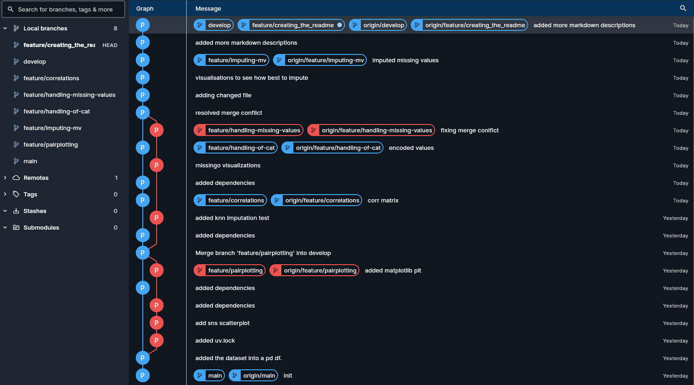

# Summary
The point of this repo is to excersiese git flow branching on preprocessing a dataset (https://www.kaggle.com/datasets/slmsshk/medical-students-dataset)

## The following branches are present:
1. main
2. develop
3. feature/creating_the_readme
4. feature/imputing-mv
5. feature/handling-missing-values
6. feature/handling-of-cat
7. feature/correlations
8. feature/pairplotting

## Visualization

Visualizations of the git workflow:

